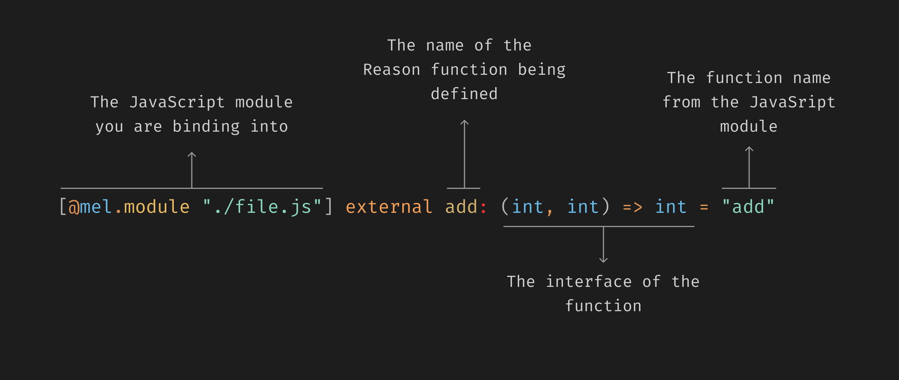

# bindings
Melange bindings repository for popular JavaScript libraries

- **Learn**: if it's the first time you bind, having a bunch of examples in one place, helps. If it's the 99th time you do, having a cheatsheet is also good.
- **Use them by owning them**: The usage of this repository is to copy/paster into you project. This way you own the bindings and you can change them if you need.
- **To collaborate and unify efforts**: most bindings become outdated, abandoned or unmaintained. Having a central place to collaborate and unify efforts is a good way to avoid this, and when newer versions of Melange get released we can update all the bindings at once.

## What are bindings
Bindings in Melange is the method to communicate with JavaScript and have some garanties on the type-checker. In other languages this is called FFI (Foreign Function Interface).

The other direction, calling Reason from JavaScript is explained here: https://melange.re/v2.0.0/communicate-with-javascript/#use-melange-code-from-javascript

```js
// file.js
export const add = (a, b) => a + b
```

Given a lovely `file.js`, the way to call the `add` function from Reason is to bind to it, by telling the compiler that each time you call `add` (in Reason files) it should be called with two integers and it will return an integer.

In this particular case, the proper binding should be:



## Particularities of bindings

### 1) Bindings can be unsafe
If you lie (by having a mistake on the binding) to the compiler, this can cause a runtime crash.

### 2) Bindings are creative and subjective
There are very different approaches on how to bind a library. In simple cases, there's no room for creativity, but in more complex cases there are many ways to do it. This can vary from the level of safety, the "cost" of the binding or even the external API you want to provide.

### 3) Require knowledge about runtime representation
In order to bind a library, you need to know how Melange represents runtime data. This is not a big deal, but it's something to keep in mind. All information about runtime representation is available in the docs: https://melange.re/v2.0.0/communicate-with-javascript/#data-types-and-runtime-representation

### 4) Some dynamic JavaScript patterns aren't possible to bind (but workarounds are possible)
Some patterns from JavaScript aren't possible to represent in the type-checker. A silly example would be:

The following code is not possible to bind 1 to 1:

```js
export const add = (a, b) => a + b
add.one = (a) => add(a, 1)
```
You can't have a function and a property that is also a function in the same value in Reason. The workaround is often to bind differently than the original API.

In this case, you could have:

  ```reason
[@mel.module "./file.js"] external add: (int, int) => int = "add"
[@mel.module "./file.js"] [@mel.scope "add"] external addOne: int => int = "one"
```

### 5) The cost of the binding (runtime overhead vs zero-cost)

zero-cost bindings means to not have any runtime overhead. This is often preferred, but there are also cases where a small overhead is acceptable. For example, if you want to provide a more idiomatic API to Reason, you can have a small overhead by using a library.

This is a source of dicussion on other communities and we don't have a strong opinion on this. We think that both approaches are valid and we should have both approaches in the bindings repo.

In case of having the duality, it's a good idea to expose both approaches in the same package. For example:

```bash
/packeges/lodash_zero
/packeges/lodash_safe
```

Read the full https://melange.re/v2.0.0/communicate-with-javascript

## How it works

Copy and paste into your apps, own the bindings, change them if you need and contribute back the changes.

### What's the structure

```bash
├── packages/ # stable bindings, build in CI and compiles with latest melange
└── drafts/ # the unstable bindings, not build in CI, neither compiles with latest melange, can contain ReScript code, JSX2 code, etc.
```

If a package needs testing, documentation or any additional piece is probably a good idea to promote it as a separate repo under melange-community.

Inside each package we could specify different kinds of bindings depending on the safety level, the "cost" or even the library version. For example:

```bash
$ ls -d packages/lodash*
/packages/lodash_safe
/packages/lodash_zero
/packages/lodash_v2
```

### How to contribute

1. Fork the repo
2. Create a new branch
3. Add your bindings
4. Create a PR

## Tools to generate bindings

There has been a bunch of attemps at automatic generate bindings. Mostly 1) from TypeScript definitions, 2) from JavaScript code.

### From JavaScript

- https://github.com/jchavarri/rebind Automated generation of Reason/BuckleScript bindings from JavaScript code
- https://github.com/emnh/js-to-reasonml-transpiler JavaScript to ReasonML transpiler for small code examples
- https://github.com/chenglou/jeason crappy js-to-reason converter
- https://github.com/jaredly/rejs JavaScript to Reason transpiler

### From TypeScript

- https://github.com/ocsigen/ts2ocaml Generate OCaml bindings from TypeScript definitions via the TypeScript compiler API
- https://github.com/jsiebern/re-typescript An opinionated attempt at finally solving typescript interop for ReasonML / OCaml
- https://github.com/andrewray/DefinitelyMaybeTyped TypeScript to js_of_ocaml
- https://github.com/rrdelaney/ReasonablyTyped Converts Flow and TypeScript definitions to Reason interfaces
- https://github.com/Diullei/ts2reason Automatic generation of ReasonML bindings using TypeScript definitions
- https://github.com/joshaber/ts2re Convert TypeScript type declarations to Reason

### Using LLM

ChatGPT has been reported as being very helpful as starting point, but we haven't explored it yet.
